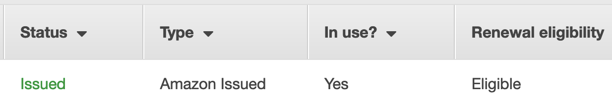

# Advanced Concepts
This document describes advanced features of CloudFauj.

We highly recommend understanding the [basic concepts](./concepts.md) before proceeding.

## Custom Domains
You can assign TLS-enabled URLs to publicly exposed Cloudfauj Applications using domains that you own. There are essentially 2 steps to achieve this:

1. Add a domain you own or control to CloudFauj
2. Create an environment configured to use the added domain

After achieving the above 2, any public apps you deploy to the domain-enabled environment will automatically be available at `https://<env>-<app>.<apex domain>` (eg- `https://staging-nginx_api.example.com`).

This format is currently enforced by the system. In future, you'd be able to specify your own URLs to use for apps.

### Add a domain
Assuming that you own `example.com` and you want to use it, add the domain to the system:

```bash
$ cloudfauj domain add example.com.yml
Registering example.com in state
Setting up Terraform configuration
Applying Terraform configuration
NS Records to be configured for example.com
ns-2048.awsdns-64.com
ns-2049.awsdns-65.net
ns-2050.awsdns-66.org
ns-2051.awsdns-67.co.uk
Domain infrastructure created successfully
```

Below is an example configuration file for your domain - `example.com.yml`

```yaml
# Apex domain name
name: example.com
# The service cloudfauj will use to manage all DNS records for the domain.
# Only "aws_route53" is supported for now.
dns_service: aws_route53
# The certificate authority to provision TLS certificates from.
# Only "aws_acm" is supported for now.
cert_authority: aws_acm
```

This command creates a [Route53 public hosted zone](https://docs.aws.amazon.com/Route53/latest/DeveloperGuide/AboutHZWorkingWith.html) and requests TLS certificates from [ACM](https://aws.amazon.com/certificate-manager/) for the domain. (In future, Cloudfauj will support more DNS services like Cloudflare & Certificate authorities such as LetsEncrypt)

Once the domain is added to Cloudfauj, the command outputs a bunch of [NS Records](https://www.cloudflare.com/learning/dns/dns-records/dns-ns-record/) that **you must configure in your domain**. This allows the Route53 Zone to assume DNS records management of your domain.

After configuring the records, head to your AWS ACM console to ensure the certificate has been `Issued`. This may take some time.



Since this zone is also inside your own AWS account, the domain and all its records are still fully under your control.

How you configure the NS records depends on your domain registrar, please check their documentation.

---
**NOTE**

Don't add a domain you don't own.
Cloudfauj won't be able to provision an ACM certificate for it and environment creation will fail.

---

You can add as many domains to cloudfauj as you like.

### Create a domain-enabled environment
You must [create a new environment](./create-env.md) to use the added domain.

Specify the domain configurations in your environment's config file:

```yaml
name: staging
domain: example.com
load_balancer: aws_alb
```

Once this env is up, all public apps deployed in it will automatically receive a TLS-enabled URL!

---
**NOTE**

1 domain can be used by multiple environments. 1 environment can only use 1 domain.
For eg- `example.com` can be used with both `staging` and `test1` envs. But if you assign `example.com` to `test1`, then you can't also assign `foobar.com` to it unless you destroy and re-create it.

---

### Managing domains
You can list the domains you've added to Cloudfauj.

You can also delete them, which would delete all the Cloudfauj-created infrastructure including the ACM Certificate.

```
$ cloudfauj domain ls
example.com
foobar.com
qwerty.org

# Be very careful with this command!
# Make sure none of your environments are relying on a domain before deleting it.
$ cloudfauj domain delete foobar.com
Destroying Terraform infrastructure
Domain deleted successfully
```

## Terraform Operations
Even though Cloudfauj creates and manages your infrastructure, it doesn't limit you from making any custom changes to it. You can make changes to the infrastructure configuration and run Terraform `plan` & `apply` over them using the `tf` CLI command.

```
$ cloudfauj tf plan --domain example.com

$ cloudfauj tf apply --env staging
```

See `cloudfauj tf --help` for details.