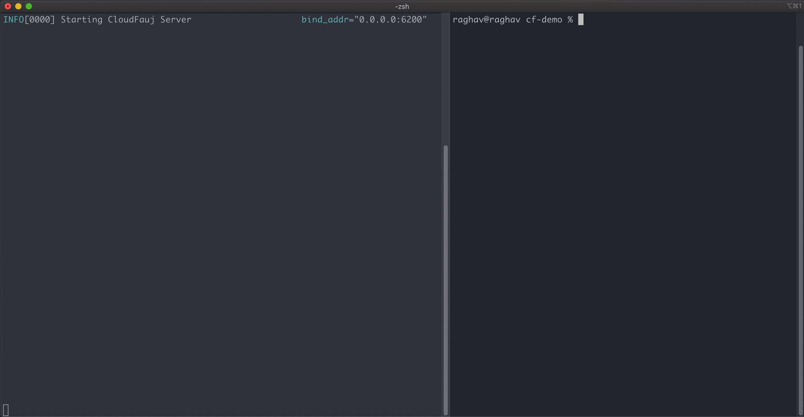
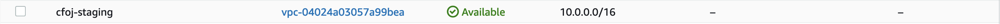
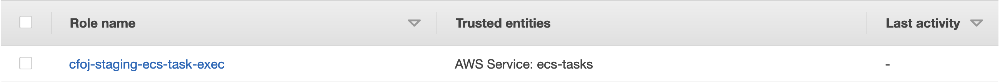
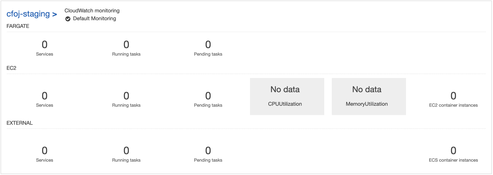
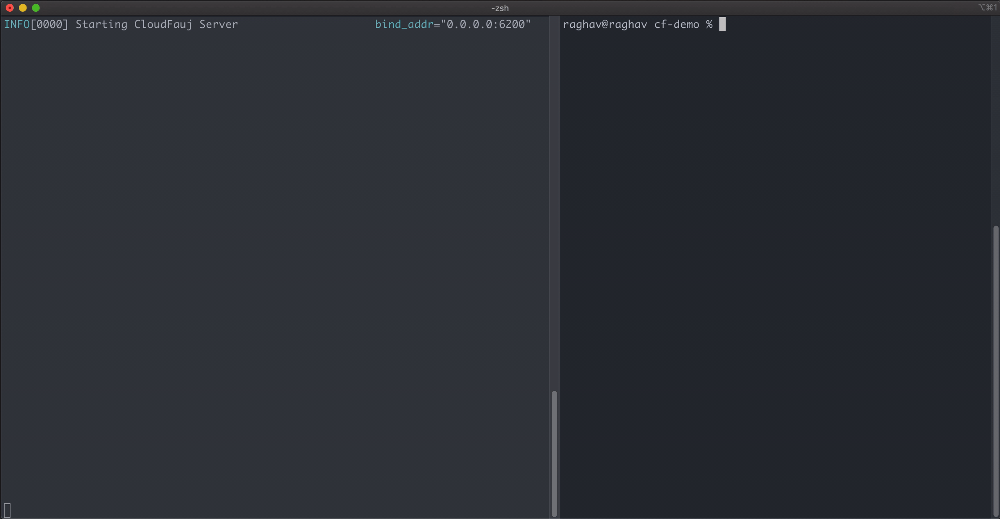

# Creating an Environment
To create an [environment](./concepts.md#environment), you should already have a [server](./concepts.md#server) up and running.

Let's start by firing up the client to list environments:
```
$ cloudfauj env list
No environments created yet
```

This means our server is responding to our requests and we currently don't have any environments to deploy apps to. Let's create one!

---
**NOTE**

Cloudfauj is not responsible for any costs you incur while following this guide.

---

## Prerequisites
To be able to create infrastructure, you need an **AWS Account**. Cloudfauj server should already be able to make requests to this account (see [permissions required](./getting-started.md#iam-permissions)).

## Create
The `env create` command lets you create a new environment. You need to supply a configuration file for this env. As of today, this file is very minimal and only specifies the env's name. Below is an example, let's call it `cf-env-staging.yml`:

```yaml
---
# Name uniquely identifies an environment in cloudfauj.
# 2 environments cannot have the same name.
# Env name should only contain lowercase alphanumeric characters.
# Multiple words should be separated by an underscore.
name: staging
```

Running the command creates several resources for the `staging` environment in your AWS account. Cloudfauj also starts tracking all these resources in its own [internal state](./getting-started.md#configuration).

In the below example, you see the server on the left and client on the right.



These include a VPC, Internet Gateway, Subnets, IAM role, ECS Fargate Cluster, etc. Cloudfauj always tries to eliminate costs incurred due to an empty environment (i.e., an env that doesn't contain any apps).







Try running the `env list` command now. You should see the staging env in response.

## Destroy
Use `env destroy` to destroy an environment. This deletes all AWS resources created for the env and removes it from Cloudfauj's internal state.



**Previous**: [Concepts](./concepts.md)

**Next**: [Deploying an Application](./deploy-app.md)
