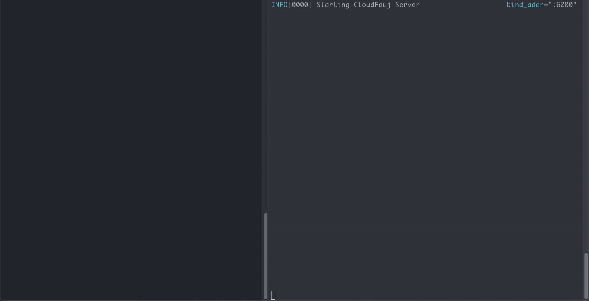
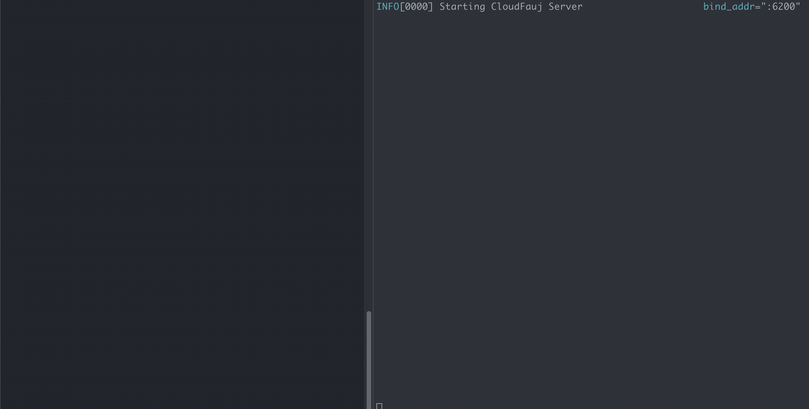
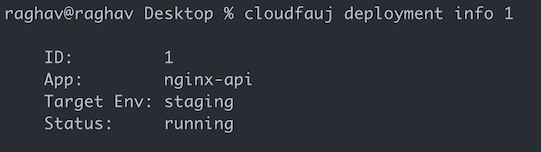
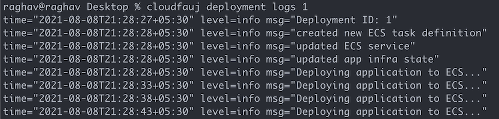

# Deploying an Application
Once you app is ready to run, you can use the Cloudfauj CLI to deploy it to an environment.

**NOTE**: Deploying an app provisions real infrastructure that costs money. If you're just trying things out, make sure to destroy the app after testing. Cloudfauj is not responsible for any costs you incur.

## Prerequisites
As of today, Cloudfauj only focuses on deploying artifacts. It does not help build or publish them.

Cloudfauj supports deploying Docker images from AWS ECR. So you need to pack your app inside a Docker image and [publish](https://docs.aws.amazon.com/AmazonECR/latest/userguide/docker-push-ecr-image.html) it to a public or private ECR repository. This can either be done manually or through a build system such as Jenkins.

## Configuration
For cloudfauj to be able to run your container stably, it needs to understand the resources required by it.

You specify these resources in a `.cloudfauj.yml` file. As a best practice, you should commit this file in the root directory of your app.

Below is an example configuration:
```yaml
---
# Name uniquely identifies an application within an environment.
# 2 apps cannot have the same name if they're in the same env.
# However, they can have the same name if they're deployed to different envs.
name: nginx-api
# Specifies the type of application. A value of "server" signifies a TCP server.
# This is how you deploy REST APIs for eg. As of today, only server type is supported.
type: server
# The health check configuration. As of today, only the "path" is supported.
healthcheck:
  # Value of path is the API endpoint to probe for health. It must return 200.
  path: "/ping"
# Whether the app is public-facing or internal. Only public apps are supported as of now.
visibility: public
# The resources the app needs to run stably
resources:
  # Number of CPU units
  cpu: 100
  # Memory required in MB
  memory: 600
  network:
    # The TCP port your app server listens on
    bind_port: 80
``` 

## Deploy
The `deploy` command deploys your application's artifact to AWS.

When deploying an app for the first time to an environment, Cloudfauj server creates all infrastructure needed and starts running it. You specify the target env and the docker image to deploy, the `.cloudfauj.yml` gets picked up automatically from current dir.

In the below example, we deploy a [demo nginx server](https://github.com/cloudfauj/demo-server) from its root directory.

```
$ ls -al
-rw-r--r--  1 raghav  wheel   151 Aug 10 09:52 .cloudfauj.yml
-rw-r--r--  1 raghav  wheel   187 Aug 10 09:52 Dockerfile
-rw-r--r--  1 raghav  wheel  1066 Aug 10 09:52 LICENSE
-rw-r--r--  1 raghav  wheel    66 Aug 10 09:52 README.md
-rw-r--r--  1 raghav  wheel   277 Aug 10 09:52 nginx.conf

# Build the docker image and publish it to ECR.
# You may be doing this manually or via a build system.

# Deploy using Cloudfauj
$ cloudfauj deploy --env staging xxxxxxxxxxxx.dkr.ecr.ap-south-1.amazonaws.com/demo-server:latest
```



Once deployed, you can get the IP of the app from ECS dashboard, then access it from your browser. In future, Cloudfauj will also support custom domains with automatic TLS so you don't have to work with IPs directly.

Subsequent deployments automatically change the infra based on updated requirements in the app config.

```
# Changed the image tag from latest to v1.0.3
$ cloudfauj deploy --env staging xxxxxxxxxxxx.dkr.ecr.ap-south-1.amazonaws.com/demo-server:v1.0.3
```



The CLI provides a couple of useful commands to work with deployments. Below are some examples:

```
$ cloudfauj deployment ls
No deployments running at this time
```





## Destroy
Use `app destroy` to destroy an application. This deletes all AWS resources created for the app within an environment and removes it from Cloudfauj's internal state tracking.

```
$ cloudfauj app destroy --env staging nginx-api
Destroying nginx-api from staging
Done
```

Previous: [Creating an environment](./create-env.md)

Top: [Table of Contents](../README.md#documentation)
